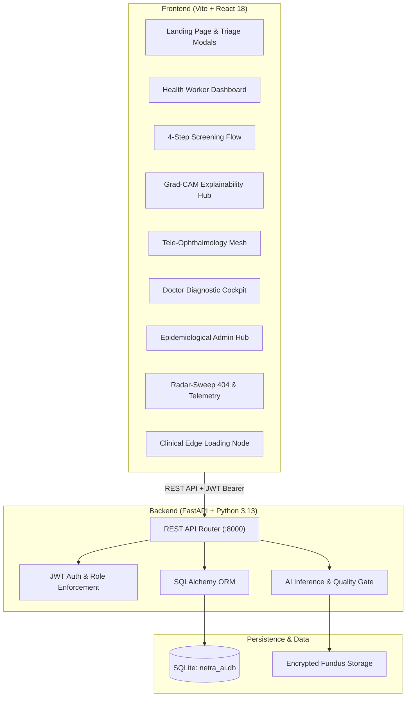

# NetraAI (नेत्रAI) — AI-Assisted Retinal Screening Platform

> **Clinical-Grade AI Screening & Tele-Ophthalmology Network for Rural Blindness Prevention**  
> *Compliant with ICDR 5-Stage Retinopathy Protocols, ABDM/ABHA Data Standards, and Offline-First Primary Care Triaging.*

---

## 🌟 Overview

**NetraAI** is an autonomous, clinical-grade medical AI screening system engineered to triage Diabetic Retinopathy (DR) and sight-threatening retinal pathologies across remote community health centers (PHCs), mobile eye camps, and tertiary district hospitals.

The platform provides a unified digital pipeline combining:
- **Instant DR Grading**: 5-stage International Clinical Diabetic Retinopathy (ICDR) classification with calibrated confidence scores.
- **Explainable AI (Grad-CAM)**: High-resolution visual heatmaps highlighting microaneurysms, blot hemorrhages, and hard exudates to substantiate AI findings.
- **Offline-First Mesh**: On-device edge inference with automatic SQLite synchronization when internet connectivity resumes.
- **Doctor Diagnostic Cockpit**: Multi-patient verification queue, specialist second opinions, and tele-ophthalmology referral sign-offs.
- **Epidemiological Telemetry**: Real-time regional analytics, district camp triage volumes, and NPCB compliance tracking.

---

## 🏗️ Architecture



---

## 🚀 Key Features

| Feature | Description |
|---|---|
| **Health Worker Dashboard** | Dark-mode clinical workspace with live battery indicators, retinal anatomy viewer, and camp screening logs. |
| **Bilateral Fundus Capture** | Guided quality gate checking illumination, focus, and macula centering before inference. |
| **Grad-CAM Visual Heatmaps** | Multi-layer overlays (original, heatmap, vascular tree) showing pathological features driving the score. |
| **Tele-Ophthalmology Hub** | Live video/audio specialist consultations, interactive fundus telestration annotations, and referral tracking. |
| **Doctor Diagnostic Cockpit** | Prioritized case triage (`HIGH`, `MEDIUM`, `LOW`), clinical note signing, and ABDM referral authorizations. |
| **State Epidemiological Hub** | Village-wise disease prevalence heatmaps, referral conversion SLAs, and CSV dataset export. |
| **Radar-Sweep 404** | Tactical radar sweep with sweep-synced contact pings, outline-mix 404, inline route search, and Web Audio ping synthesizer. |
| **Clinical Loading Node** | Triple counter-rotating calibration rings, scanning laser sweep, and real-time edge node telemetry. |

---

## 🛠️ Technology Stack

### Frontend
- **Framework**: React 18 with Vite
- **Styling**: Tailored Medical-Dark Vanilla CSS Design Tokens (Teal `#14B8A6`, Cyan `#06B6D4`, Deep Navy `#030712`)
- **Animation**: Framer Motion & Lucide Icons
- **PDF Generation**: jsPDF with bilingual English/Hindi reporting support

### Backend
- **Framework**: FastAPI (Asynchronous Python REST API)
- **Database**: SQLite with SQLAlchemy ORM (auto-seeded on startup)
- **Authentication**: JWT Bearer Tokens with bcrypt password hashing & role-based access control
- **API Documentation**: Auto-generated interactive Swagger UI at `/docs`

---

## 💻 Quickstart Guide

### Prerequisites
- **Node.js**: v18 or higher
- **Python**: v3.10 or higher

### 1. Start Backend Server
```bash
cd backend
python -m pip install -r requirements.txt
python -m uvicorn app.main:app --reload --port 8000
```
- API Health Check: `http://localhost:8000/api/health`
- Interactive Swagger Docs: `http://localhost:8000/docs`

### 2. Start Frontend Application
```bash
cd frontend
npm install
npm run dev
```
- Application Portal: `http://localhost:5173`

---

## 🔑 Demo Credentials

| Role | Employee ID / Username | Password | Default Portal |
|---|---|---|---|
| **Health Worker** | `health001` | `netra123` | `/dashboard` |
| **Ophthalmologist** | `doctor001` | `netra123` | `/doctor` |
| **State Health Admin** | `admin001` | `netra123` | `/admin` |

---

## 📜 ICDR Diabetic Retinopathy Classification

NetraAI adheres to the International Council of Ophthalmology grading standard:

1. **Grade 0 (No DR)**: No microaneurysms or vascular abnormalities. *Annual screening recommendation.*
2. **Grade 1 (Mild NPDR)**: Microaneurysms only. *6–12 month follow-up.*
3. **Grade 2 (Moderate NPDR)**: Microaneurysms, cotton wool spots, and hard exudates. *Tele-consultation recommended.*
4. **Grade 3 (Severe NPDR)**: Rule of 4:2:1 (severe hemorrhages in 4 quadrants, venous beading in 2, or IRMA in 1). *Urgent referral within 2–4 weeks.*
5. **Grade 4 (Proliferative DR - PDR)**: Neovascularization and/or vitreous/preretinal hemorrhage. *Immediate specialist escalation.*

---

## 📄 License

This project is developed for rural healthcare accessibility and community screening.
Distributed under the MIT License.
